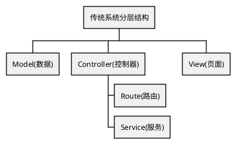
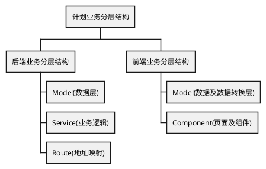
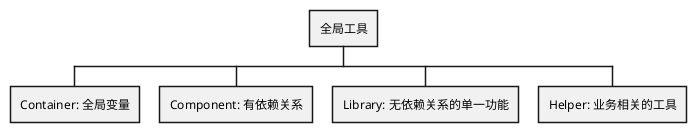

### 软件架构

### 目标

- [x] 查询列表 sort 代表排序, 传输字段名称, 多个名称使用 "," 分割, "-" 代表倒序
- [ ] 前后端均用 json 传输参数, json 中键名均用驼峰式命名, 数值均为强类型
- [x] 只返回需要返回给前端的字段, 拒绝冗余/敏感字段传输给前端
- [ ] 添加/编辑/删除必须增加操作日志, 查看按情况增加操作日志
- [ ] 改变其他的参数不得改变接口本身的作用, 操作若涉及多功能必须在后端封装成一个事务安全的接口
- [ ] 后端所有业务功能均使用 Result 传输, 需要一个检查链

### 组件

#### BaseService

- allByAttr
- lists
- listsByAttr
- exists
- existsByAttr
- get
- getByAttr
- save
- add
- edit
- editByAttr
- delete
- deleteByAttr

