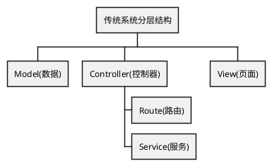
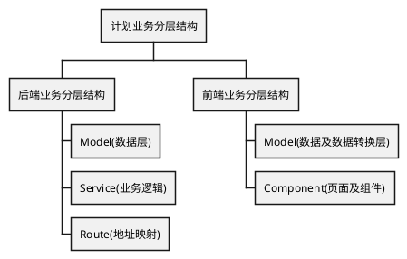
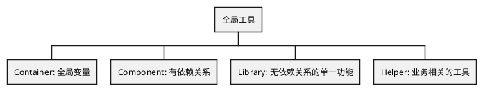
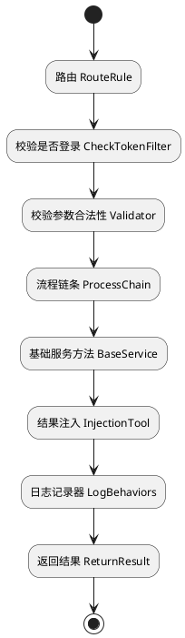

### 软件架构

```puml
@startwbs
* 传统系统分层结构
** Model(数据)
** Controller(控制器)
*** Route(路由)
*** Service(服务)
** View(页面)
@endwbs
```

```puml
@startwbs
* 计划业务分层结构
** 后端业务分层结构
*** Model(数据层)
*** Service(业务逻辑)
*** Route(地址映射)
** 前端业务分层结构
*** Model(数据及数据转换层)
*** Component(页面及组件)
@endwbs
```

```puml
@startwbs
* 全局工具
** Container: 全局变量
** Component: 有依赖关系
** Library: 无依赖关系的单一功能
** Helper: 业务相关的工具
@endwbs
```

### 请求/响应

```puml
@startuml
(*)  --> "路由 RouteRule"
--> "校验是否登录 CheckTokenFilter"
--> "校验参数合法性 Validator"
--> "流程链条 ProcessChain"
--> "基础服务方法 BaseService"
--> "结果注入 InjectionTool"
--> "日志记录器 LogBehaviors"
--> "返回结果 ReturnResult"
-->(*)
@enduml
```

### 组件

#### BaseService

